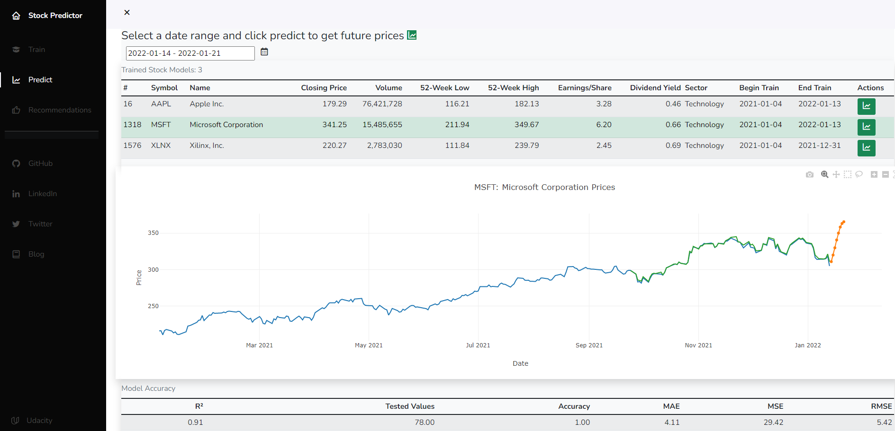
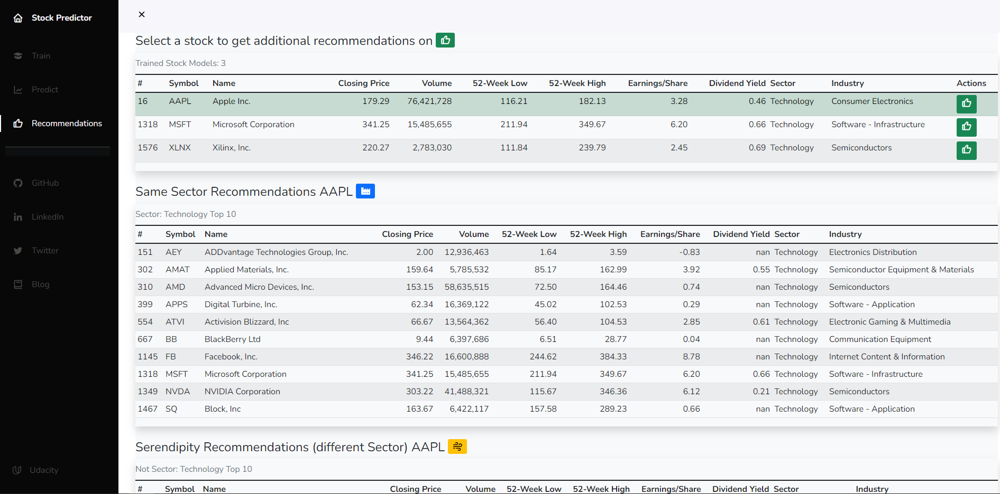

# Capstone-Project4-Udacity-Data-Scientist
As part of the udacity.com Data Scientist nanodegree, this is project four and the final project of the program, otherwise known as our Capstone Project. This project involves building a stock price predictor that takes daily trading data over a certain date range as input, and outputs projected estimates for given query dates. The inputs will contain multiple metrics, such as opening price (Open), highest price the stock traded at (High), how many stocks were traded (Volume) and closing price adjusted for stock splits and dividends (Adjusted Close); we only need to predict the Adjusted Close price.

Investment firms, hedge funds, and even individuals or day traders have been using financial models to better understand market behavior and make profitable investments and trades. A wealth of information is available in the form of historical stock prices and company performance data, suitable for machine learning algorithms to process. According to an article by Mark Kolakowski ["How Robots Rule the Stock Market (SPX, DJIA)"](https://www.investopedia.com/news/how-robots-rule-stock-market-spx-djia):

> only 10% of trading volume now comes from human discretionary investors, per data from JPMorgan Chase & Co. (JPM) cited by Bloomberg

##### Source: "Best Forex Robots 2021" by Kane Pepi at https://insidebitcoins.com/forex-robot

---
### Capstone Best Practices
I will be showcasing the following Data Science and Software Engineering Best Practices:

* Github and Code Quality including this repository along with comments, docstring in each function, class, or method, unit tests, and logical functions and PEP8 style guideline conventions
* Machine Learning techniques to predict prices and the proper use of pipelines, traning vs. test data, and model evaluation
* Deployment of our web application to the Heroku cloud hosting platform showing our Stock Predictor and Stock Recommendation Engine models and allowing users to select Stocks and get predictions on adjusted closing prices over a given time period as well as get suggestions on additional stocks based on the one they have selected

As in my previous project, I have also documented the work in the blog below:

#### My BLOG is HERE: https://hmelendez001.github.io/2022/01/26/Udacity-Data-Scientist-Nanodegree-Capstone.html

# How to Run the Web Application
From the **app** folder run the following python command:

##### &nbsp;&nbsp;&nbsp;&nbsp; python run.py

You should see something like this on a local browser:

---

#### Alternatively you can run my Heroku web installation here: https://helderstockpredictor.herokuapp.com/

---

From the dashboard landing page, beginn typing the name of a stock ticker or name, like GOOG or Google. You will see a drop-down as you type of possible matches. Select a Stock and select a date range for which you would like to train the stock predictor. These type ahead names are just a list of US listed names found at the time of this writing. You may type a ticker not found on the search as long as it is a valid US listed stock ticker found by the Yahoo! Finance API.

Then you can run the predictor for any given date range beyond the last training date.

If you hover over any of the Model Accuracy score values at the bottom you will see a Tool Tip explaining what the value means, e.g. RMSE is Root Mean Squared Error.

The application will also show you some stock recommendations for other ticker or symbols that are similar to the one you selected, using a Content Recommendation Engine.

---

# How to Clear the Session or "Start Over"
The web application uses a Flask Session to persist updates made through the web application. If at any point you want to start over or reset this "cache" then simply remove the flask_session directory which gets created:

##### &nbsp;&nbsp;&nbsp;&nbsp; rmdir flask_session

---

# Libraries Used
| Library | Description |
| :--- | :--- |
| Bootstrap | This toolkit was used to simplify writing the HTML5 elements including CSS styles in our web application |
| Flask | This Python micro web framework was used to write the backend of our web application |
| Flask-Session | This is a utility for managing Session state in our Flask web application |
| Gunicorn | This is needed for web application deployment |
| Heroku | This is used to access the hosting platform |
| Jinja2 | Utility for running Python constructs inside of HTML for our web application |
| JQuery | This is the javascript for manipulating objects on the UI web application dashboard |
| Json | This is the package for manipulating JSON text and objects |
| Matplotlib | This was the graphing library used to generate visualizations in our Jupyter Notebook analysis and testing |
| Numpy | This is where numerical constants like np.nan came from|
| Pandas | This is the work horse behind our analysis for reading in the DataFrame from the CSV file and performing various data analysis and preparation |
| Plotly | This was the graphing library used to generate our visualizations |
| Seaborn | This was the visualization library used to generate heatmaps in our Jupyter Notebook analysis and testing  |
| Sklearn | This is the scikit-learn's Pipeline and LinearRegression used to build and run our machine learning model |
| Sqlalchemy | This is the SQLite database package used to write and read to and from the SQL database |
| YFinance | This is the Yahoo Finance API module |

# Files in this Repository
| File | Description |
| :--- | :--- |
| app | The dashboard or web application main directory |
| app > static | Directory containing static content such as CSS cascading stylesheets or JavaScript for the web application |
| app > static > css | Directory containing the CSS cascading stylesheets used to style (color, size, fonts, etc.) for the web application |
| app > static > css > dashboard.css | The main CSS cascading stylesheet used to style (color, size, fonts, etc.) the web application |
| app > static > scripts | Directory containing the common JavaScript code for the web application |
| app > static > scripts > dashboard.js | The main JavaScript file for the web application |
| app > templates | Directory with the HTML files for the web application |
| app > templates > master.html | The main page or the landing of the web application |
| app > templates > modal.html | Common HTML code to implement a Bootstrap Modal set of popups for our web application |
| app > templates > navbar.html | The left navigation menu for all the pages of the web application |
| app > templates > predict.html | The page used for predicting or forecasting stock prices on the web application |
| app > templates > recommend.html | The page used for displaying stock recommendations on the web application |
| app > templates > toast.html | Common HTML code to implement a Bootstrap Toast popup for our web application |
| app > \_\_init__.py | This file allows the folder to be set up as a Python module |
| app > run.py | The Flask Python code that runs the web application |
| app > StockDateValidator.py | The Python code that does the date validation for the Machine Learning model inputs |
| app > StockHistory.py | The Python code that caches and/or retrieves the historical stock data rom the Yahoo! Finance API as input to the Machine Learning model |
| app > StockModel.py | The Python abstract class to make the Machine Learning model pluggable or allow for a different model in the future with minimal code changes |
| app > StockModelLinear.py | The StockModel Linear Regression child model used for Machine Learning |
| app > StockPricePredictor.py | The Python class that encapsulates the validation and call to get price predictions from the Machine Learning model |
| data | The directory contaning the raw data for this project |
| data > All_Data_Nasdaq.csv | The raw data NASDAQ Equity stock data |
| data > DatabaseCache.db | The SQL Lite connection file for caching daily API calls |
| data > DOL_Weekly_Unemployment_US_2021.csv | The pre-processed Unemployment data from the Department of Labor Bureau web site limited to national 2021 numbers |
| data > Global_Mobility_Report_US_2021.csv | The raw Google mobility report for the US year 2021 |
| data > all_stocks_swingtradebot_dot_com.csv | The raw Equity stock data from SwingTradeBot.com |
| data > bitcoin_stock_2021.csv | The raw Equity stock data from Yahoo! Finance for 2021 USD BTC or BitCoin |
| data > cpi_index_2021.csv | The raw Equity price data from Yahoo! Finance for 2021 Consumer Price Index (CPI) |
| data > djia_index_2021.csv | The raw Equity price data from Yahoo! Finance for 2021 Dow Jones Industrial Average (DJIA) |
| data > future_prices_2022.csv | The raw Equity price data from Yahoo! Finance for year to date 2022 Tesla Motors (TLSA), Apple (AAPL), and Microsoft (MSFT) |
| data > nasdaq_composite_index_2021.csv | The raw Equity price data from Yahoo! Finance for the 2021 NASDAQ Composite Index |
| data > r539cy_DOL_Unemployment.csv | The raw Unemployment data from the Department of Labor Bureau web site |
| data > sp500_index_2021.csv | The raw Equity price data from Yahoo! Finance for 2021 S&P 500 index |
| data > tesla_stock_2021.csv | The raw Equity price data from Yahoo! Finance for 2021 Tesla Motors |
| data > texas_instruments_stock_2021.csv | The raw Equity price data from Yahoo! Finance for 2021 Texas Instruments |
| images | Used to store some screenshot images for this file |
| images > Project4CapstoneStockPredictorMaster.png | Screenshot of the web application landing page used above |
| images > Project4CapstoneStockPredictorPredict.png | Screenshot of the web application price prediction page used above |
| images > Project4CapstoneStockPredictorRecommend.png | Screenshot of the web application recommendation results based on a selected stock used above |
| images > Project4CapstoneStockPredictorTypeAheadSearch.png | Screenshot of the web application type ahead results search ala Twitter used above |
| LICENSE | The MIT License file |
| Procfile | Instructs the runtime to use gunicorn to run our dashboard |
| README.md | The file you are currently reading |
| nltk.txt | This will tell Heroku to automatically download the modules in this file and install them into our application at build time |
| requirements.txt | Contains the list of required libraries, a subset of those listed in the "Libraries Used" section above but includes the versions required at run time |
| runtime.txt | The Python runtime version being used |

# How to Deploy to the Heroku Hosting Platform
| Step | Command | Description |
| :--- | :--- | :--- |
| 1 | mkdir web_app | Create a folder to contain all the assets to deploy |
| 2 | cp -R <root folder path of this project> web_app | Copy all the files in this project to the web_app folder you created in step 1 |
| 3 | heroku --version | Verify the Heroku installation | 
| 4 | curl https://cli-assets.heroku.com/install-ubuntu.sh \| sh | Install the necessary Heroku assets using their installation script | 
| 5 | heroku login -i | Assuming you have a Heroku account already, if not go to heroku.com and set up your account then issue this command to login with your credentials |
| 6 | git init
git config --global user.email "you@example.com"
git config --global user.name "Your Name" | Initialize a git repository with these ONE-TIME commands, if you do not already have one in Heroku |
| 7 | cd web_app
cp -R app/templates .
cp app/run.py . | You will need to copy the app/ directory contents to the root folder so that Heroku will find it at runtime |
| 8 | git add .
git status
git commit -m "your message" | Use this chain of command to commit your files to the Heroku git repository |
| 9 | heroku create my-app-name --buildpack heroku/python | Create a uniquely named Heroku app using this command. If you get a message that the app name is already taken, try again with a different app name until you find one that is not taken |
| 10| git remote -v | Check that heroku added a remote repository with this command |
| 11 | heroku config:set SLUGIFY_USES_TEXT_UNIDECODE=yes
heroku config:set AIRFLOW_GPL_UNIDECODE=yes
heroku config
git push heroku master | Set any environment variable to pass along with the deployment and push the app to Heroku |
| 12 | From a web browser go to the link for your as named in step 8 above, something like https://app-name.heroku.com | Confirm your app is running on Heroku |

### Performance
So over a period of the last 60+ days of the year 2021, our linear model looks good for our 3 symbols, with an accuracy hovering around 100 and a scatter plot clustering relationship in a linear pattern.

Tesla seems to be very volatile as it has the highest MAE, MSE, and RMSE values of the 3 stocks, but Apple and Microsoft score much lower. 

### Machine Learning: Refinement and Potential Improvements
Although all 3 tickers (TSLA, AAPL, and MSFT) have a decent linear fit r-square scores relatively close to 1 and overall accuracy within 100. Definite room for improvement here, perhaps analysis of additional indicators that are specific to the stock in question to analyze the health of the underlying company ("P/E ratio or price-to-earnings ratio, P/B ratio or price-to-book ratio, liquidity ratios, debt ratios, Return ratios, Margins, etc.") or even additional models beyond a linear fit or the basic technical analysis being done here. There are other forms of analysis that include NLP or Natural Language Processing where I can evaluate news, tweets, and social media posts associated to the company, otherwise known as Sentiment Analysis.

If we go with another model, notice that our code relies on a base class `TrainedModel` so that we could more easily swap out our `TrainedModelLinear` with say `TrainedModelLSTM` deep learning. From [Wikipedia: Long short-term memory](https://en.wikipedia.org/wiki/Long_short-term_memory):

> Long short-term memory (LSTM) is an artificial recurrent neural network (RNN) architecture used in the field of deep learning. Unlike standard feedforward neural networks, LSTM has feedback connections. It can process not only single data points (such as images), but also entire sequences of data (such as speech or video). For example, LSTM is applicable to tasks such as unsegmented, connected handwriting recognition, speech recognition and anomaly detection in network traffic or IDSs (intrusion detection systems).

Many of the existing Stock Predictor models I found online employ LSTM because of the sequential nature of the historical data.

Sidebar: There were headlines around Sentiment Analysis where bots picked up news of a fictional character dying on a Peloton bike. This prompted a sell off of the company stock prompting analysts to ask where the trading bots and algorithms fooled into confusing news of a fictional character's death as real news or where they actually smarter than that and knew it was a fictional character but anticipated how this would affect the actual company's image: [Peloton stock slumps after morbid product placement in "Sex and the City"](https://www.cbsnews.com/news/peloton-stock-death-by-peloton-just-like-that-mr-big)

> Shares of Peloton, the fitness equipment company, fell 11.3% Thursday — tumbling to a 19-month low — after a key character in HBO Max’s “Sex and the City” revival, “And Just Like That,” was shown dying of a heart attack after a 45-minute workout on one of the company’s exercise bikes.
  
### Content Based Recommendation: Refinement and Potential Improvements
Even though I was looking at two technology stocks: IBM and Apple, the recommendation engine actually gave us some symbols or names not in the technology sector: a pharma BridgeBio Pharma, Inc., a leisure and travel one Carnival Corporation, an entertainment one AMC, and even a bank Bank of America Corporation. But how to measure and improve our recommendations? We could compare against what other online recommendation engines make. Sites like [seekingaplha.com](https://seekingalpha.com) will provide stock recommendations by sector but that comes at a premium. In fact, we'll be hard pressed to find anything online that will give us these types of recommendations. At best, for a stock like Apple, we can find some online articles or sites (https://www.tipranks.com, https://finance.yahoo.com, or https://marketchameleon.com) that recommend similar symbols and we can see AMD, NVDA, TSLA, among others also appear in these type of recommendations. But this is just a small sample of data and not enough to tell us how precise our picks are. Evaluation of our Content Based Recommendation Engine would have to be more fully tested before attempting to deploy to the real world.

# Summary of the results
We explored the Yahoo! Finance historical trading data including using the Yahoo! Finance API to get live historical data. We also loaded well known financial indicator data, did some analysis and clean up of this data, and showed there was not enough significant correlation to our pricing models to warrant their use. So although we disproved our initial assumption that this financial indicator would help us in predicting closing prices, this meant that our model was a little easier to implement. We then created a Stock Predictor to predict Adjusted Closing prices based on previous day's closing data, and finally created a Content-Based Recommendation Engine to suggest similar Stocks based on most similiar Stock attributes for a given Stock.
  
### Conclusion

#### Reflection
This was a very fun project for me. Being able to choose a subject matter that I both find interesting and familiar, yet looking at it with a Data Science lens, made this work fascinating to me. It was a great opportunity to apply everything I learned and showcase how it could be applied to a real world problem and one that is close to home. The hardest part was to stop adding extra work. I probably could have kept working on this, thinking of new ways to model and test this. By far the best project in the Udacity program.

# Acknowledgements
Several code snippets came from previous lessons in our Udacity Data Scientist program. Also, where I have used others' code I have credited various contributors from StackOverflow.com, geeksforgeeks.org at https://www.geeksforgeeks.org/, https://www.tutorialspoint.com/ for sample plotly graphs, and the Data Science Stack Exchange at https://datascience.stackexchange.com. A big thank you to our instructors and all those involved in the Udacity program.

